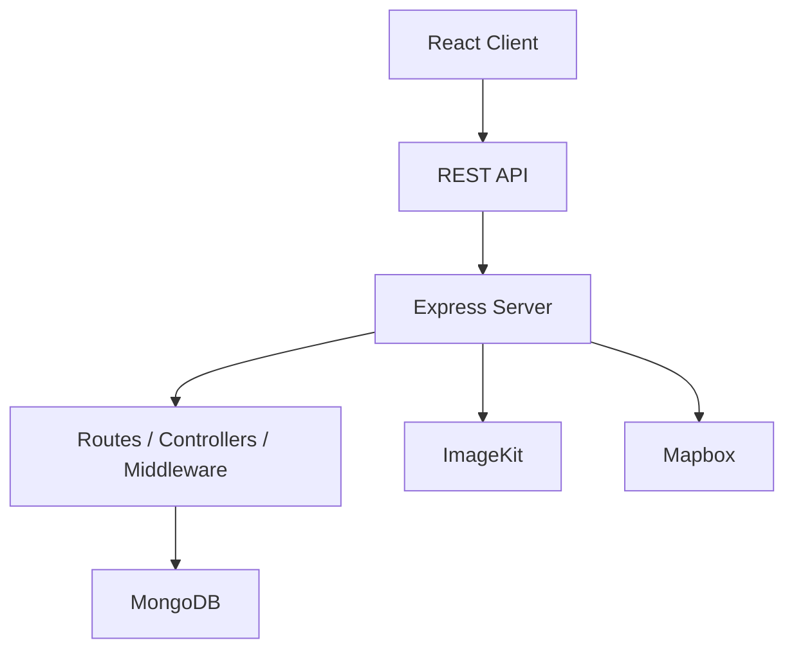

# StayNest

A full-stack accommodation marketplace built with React and Express, focused on listing discovery, host-driven listing management, bookings, reviews, wishlist saving, and image uploads.

## Overview

StayNest is a property rental application with two primary experiences:

- Travelers can browse listings, apply filters, view listing details, and book stays.
- Hosts can create, publish, edit, and delete listings, then review booking activity from a host dashboard.

The project implements a working client/server architecture with MongoDB-backed persistence, authenticated routes, protected pages, and external integrations for image hosting and maps.

## Key Features

### Traveller features
- Browse listings from the home page
- Search and filter listings by location query, guest count, price range, rating, amenities, bedrooms, beds, and bathrooms
- View detailed listing pages with gallery, amenities, bedroom details, reviews, map, and host information
- Save listings to a wishlist
- Reserve a listing by selecting dates and guest count

### Host features
- Multi-step host listing creation flow
- Upload listing photos and bedroom photos
- Publish listings from the host wizard
- Edit existing listings and manage image updates
- Delete listings
- View a host dashboard with booking summaries and calendar-style availability view

### Authentication
- User registration and login
- JWT-based authentication
- Protected routes for authenticated user actions
- Logout and current-user session checks

### Listings
- Create, read, update, and delete listings
- Store listing metadata such as title, description, category, location, price, guest capacity, beds, bathrooms, amenities, and images
- Associate listings with host users

### Booking
- Create bookings for listings
- Validate check-in/check-out dates
- Prevent overlapping reservations for the same listing
- Prevent hosts from booking their own listings
- Track booking status and payment status fields

### Reviews
- Submit ratings and review comments
- Display review summaries and rating breakdowns
- Show per-category review metrics such as cleanliness, accuracy, check-in, communication, location, and value

### Wishlist
- Save listings to a personal wishlist
- Retrieve and remove wishlist entries

### Image uploads
- Upload listing and bedroom images through ImageKit
- Delete uploaded images through the server-side ImageKit integration

### Maps
- Display listing locations with Mapbox
- Allow map-based location update during listing editing

### UI / UX features
- Responsive layout
- Dark mode support
- Toast notifications
- Protected navigation and auth-aware UI
- Intro overlay on the home page

## Application Flow

The main user journey implemented in the app is:

Browse → Search / Filter → Listing Details → Authentication → Booking / Wishlist → Reviews

The host workflow is:

Host → Create Listing → Upload Images → Publish → Edit / Delete → Manage

## Screens / Pages

The application includes the following pages and views:

- Home page for browsing listings
- Listing details page for individual stays
- Login and signup pages
- Profile setup page
- My Trips page for booking history
- Wishlists page
- Host landing page
- Host wizard for creating listings
- Edit listing page
- Host dashboard for booking insights
- Host messages page placeholder
- Host listings and calendar pages are also present in the codebase

## Tech Stack

### Frontend
- React
- Vite
- React Router DOM
- Tailwind CSS
- Mapbox GL
- react-datepicker
- Font Awesome
- ImageKit JavaScript SDK

### Backend
- Express
- Mongoose
- dotenv
- cors
- cookie-parser
- jsonwebtoken
- bcrypt

### Database
- MongoDB via Mongoose

### Authentication
- JWT stored in HTTP-only cookies
- Password hashing with bcrypt

### Storage
- ImageKit

### Maps
- Mapbox GL

### Styling
- Tailwind CSS

### Development tools
- Vite
- ESLint
- Nodemon

## Architecture

The application follows a client/server architecture:



The frontend communicates with the backend through REST endpoints, while the server handles authentication, CRUD operations, validation, and integration with external services.

## Frontend Architecture

The React client is organized into:

- Pages under the pages directory for route-level screens
- Reusable UI components under the components directory
- Context providers for authentication, theme, and toast state
- An API layer for fetching listings, bookings, wishlist data, and ImageKit uploads
- Protected routes for authenticated pages
- Reusable components such as navigation, footer, map view, and listing cards

## Backend Architecture

The server is organized around:

- Routes for auth, users, listings, reviews, bookings, wishlist, and ImageKit
- Controllers that implement business logic for each resource
- Mongoose models for persistence
- Middleware for JWT verification, role authorization, and request validation
- REST endpoints that return JSON responses with success/error payloads

## Data Models

### User
Purpose:
- Stores account information including name, email, password hash, roles, profile fields, and verification status.

Relationships:
- A user can host listings, create bookings, submit reviews, and create wishlist entries.

### Listing
Purpose:
- Represents a property available for booking.

Key fields:
- title, description, category, location, pricePerNight, guests, beds, bathrooms, amenities, images, bedrooms, rating, reviewCount

Relationships:
- Each listing has a host user and can have many bookings and reviews.

### Booking
Purpose:
- Represents a reservation made by a traveller for a listing.

Key fields:
- user, listing, checkIn, checkOut, guests, totalPrice, status, paymentStatus, specialRequests

Relationships:
- Linked to one user and one listing.

### Review
Purpose:
- Stores guest feedback for a listing.

Key fields:
- user, listing, booking, rating, categories, comment, isApproved

Relationships:
- Associated with one user and one listing.

### Wishlist
Purpose:
- Stores a user’s saved listings.

Relationships:
- Linked to one user and one listing.

## Authentication

Authentication is implemented with JWT and cookie-based sessions.

The flow is:
- Register and login endpoints create a signed JWT
- The server sets the token in an HTTP-only cookie
- Protected routes use verifyJWT middleware to read the token and attach the user to the request
- Passwords are hashed with bcrypt before storage
- The client loads the authenticated user from the /auth/me endpoint on startup

## Image Upload Architecture

Image uploads are handled through ImageKit.

The implementation flow is:
- The client requests ImageKit authentication parameters from the server
- The client uploads files with the ImageKit JavaScript SDK
- The server provides an auth endpoint and a delete-file endpoint using the ImageKit Node SDK
- The host wizard and edit listing page use this flow for listing photos and bedroom photos

## Maps

Mapbox is used in the client for:
- Displaying listing locations on the listing detail page
- Showing a map on the edit listing page
- Updating listing coordinates by double-clicking the map in the edit flow

The map component is implemented in the shared MapboxMap component and is configured with a Mapbox access token from environment variables.

## Important Engineering Decisions

The codebase demonstrates several concrete engineering choices:

- Context-based shared state for authentication, theme, and toasts
- Protected routes for authenticated experience screens
- A split frontend/backend architecture with REST API communication
- MVC-style backend organization using routes, controllers, and models
- Memoized and derived UI state for listing filtering and review metrics
- Reusable UI components for shared navigation, maps, and listing cards
- Environment-based configuration for client and server settings

## Challenges / Engineering Problems Solved

The implementation shows that the project addressed several real engineering problems:

- Building a multi-step host creation workflow with stateful form progression
- Managing authenticated user state across protected pages and API calls
- Handling image uploads for both main listing photos and bedroom photos
- Preventing date conflicts during booking creation
- Providing review summaries and rating breakdowns from collected review data
- Supporting map-based location capture for listings

## Project Structure

```text
client/
  src/
    api/
    components/
    context/
    pages/

server/
  src/
    controllers/
    middlewares/
    models/
    routes/
    db/
    config/
```

## API Overview

### Authentication
- POST /api/auth/register
- POST /api/auth/login
- POST /api/auth/logout
- GET /api/auth/me

### Users
- GET /api/users/public/:id
- GET /api/users
- GET /api/users/:id
- PATCH /api/users/:id
- DELETE /api/users/:id

### Listings
- GET /api/listings
- POST /api/listings
- GET /api/listings/:id
- PATCH /api/listings/:id
- DELETE /api/listings/:id

### Reviews
- GET /api/reviews
- POST /api/reviews
- GET /api/reviews/:id
- PATCH /api/reviews/:id
- DELETE /api/reviews/:id

### Bookings
- GET /api/bookings
- POST /api/bookings
- GET /api/bookings/:id
- PATCH /api/bookings/:id
- DELETE /api/bookings/:id

### Wishlist
- GET /api/wishlist
- POST /api/wishlist
- GET /api/wishlist/:id
- PATCH /api/wishlist/:id
- DELETE /api/wishlist/:id

### ImageKit
- GET /api/imagekit/auth
- DELETE /api/imagekit/file

## Environment Variables

### Client
- VITE_API_URL
- VITE_MAPBOX_ACCESS_TOKEN

### Server
- PORT
- MONGO_URI
- CORS_ORIGIN
- JWT_SECRET
- IMAGEKIT_PUBLIC_KEY
- IMAGEKIT_PRIVATE_KEY
- IMAGEKIT_URL_ENDPOINT

## Local Development

1. Clone the repository.
2. Install client dependencies:
   - cd client
   - npm install
3. Install server dependencies:
   - cd server
   - npm install
4. Create environment files:
   - client/.env
   - server/.env
5. Start the server:
   - cd server
   - npm run dev
6. Start the client:
   - cd client
   - npm run dev

The client expects the API base URL to point at the server, typically http://localhost:5000/api.

## Deployment

Deployment configuration is not included in the repository. Hosting and deployment settings should be configured according to the target provider.

## Testing

The repository includes a server-side test file at server/tests/auth.security.test.js. The current automated setup appears limited, and the server package test script is still a placeholder rather than a complete test runner configuration.

## Current Scope / Limitations

The codebase currently does not implement the following items:

- Real-time WebSockets or live chat
- Stripe/PayPal payment checkout
- CI/CD pipeline configuration
- Docker deployment setup
- A comprehensive automated test suite

## Future Improvements

Possible future work includes:

- Integrated payment processing
- Real-time messaging and updates
- Additional automated tests
- Deployment automation

## Screenshots

Placeholders:

- Home: docs/screenshots/home.png
- Listing Details: docs/screenshots/listing-details.png
- Host Dashboard: docs/screenshots/host-dashboard.png
- Create Listing: docs/screenshots/create-listing.png
- Booking: docs/screenshots/booking.png
- Wishlist: docs/screenshots/wishlist.png
- Reviews: docs/screenshots/reviews.png

## Demo / Repository

- Live Demo: TBD
- Frontend Repository: TBD
- Backend Repository: TBD

## Learning / Engineering Takeaways

This project demonstrates practical full-stack engineering work across:

- React component architecture and page-based routing
- Context-based state management
- REST API design and client/server separation
- JWT-based authentication and protected routes
- CRUD flows for listings, bookings, reviews, and wishlist items
- MongoDB data modeling and relationships
- External service integration for file uploads and maps

## Author

Developed as a full-stack web application project focused on real implementation details, authentication, CRUD flows, and external integrations.
